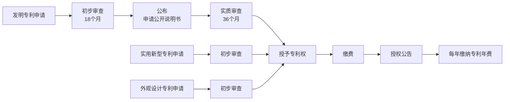

<!-- Generated by scripts/sync-obsidian-notes.mjs from Obsidian Publish. Do not edit by hand. -->

> 课程来源：信息检索与网络资源利用 | 主讲：尹成芳 | 中国石油大学（北京）图书馆

---

# 一、知识产权概述

## 1.1 知识产权制度发展历程

| 年份 | 国家 | 事件 |
|------|------|------|
| 1474 | 威尼斯共和国 | 颁布世界上<mark>第一部专利法</mark>《发明人法规》，规定了专利的标准和细节 |
| 1623 | 英国 | 颁布世界上<mark>第一部具有现代雏型的专利法</mark>《垄断法》，宣告"一切垄断非法"，将发明垄断视为例外 |
| 1709 | 英国 | 颁布世界上<mark>第一部版权法</mark>《安娜女王法令》，规定作者是著作权的拥有者及在固定期限内保护出版著作 |
| 1769 | — | 蒸汽机专利获批，工业革命的序幕由此开启 |
| 1804 | 法国 | 颁布《拿破仑法典》，<mark>第一次肯定商标权</mark> |
| 1880 | — | 白炽灯专利获批，人类照明用上了电气 |
| 1906 | — | 飞机专利获批 |

## 1.2 知识产权文献体系

知识产权制度包含三大类：

- **工业产权** → 商标文件、专利文献
- **版权作品**
- **其他** → 地理标志、植物新品种、集成电路布图、商业秘密

## 1.3 专利文献的特点及优势

> **Important: 专利文献的价值**
> - **90%~95%** 的最新技术资料首先反映在专利文献上
> - 查阅专利文献可缩短 **60%** 科研时间
> - 查阅专利文献可节省 **40%** 研发费用
> - 不重视专利信息、凭空构思，只有 **1%~3%** 的方案能够成功

## 1.4 中国专利数据概览（2025年）

- 我国共授权发明专利 **97.2万件**
- 人工智能专利有效量居全球前列
- 高价值发明专利拥有量占比达 **43.1%**

---

# 二、专利基础知识

## 2.1 专利的定义（三个角度）

| 角度 | 名称 | 含义 |
|------|------|------|
| 法律角度 | **专利权** | 国家专利主管机关依据专利法授予申请人的一种实施其发明创造的专有权 |
| 技术角度 | **专利技术** | 受专利保护的技术发明 |
| 文献角度 | **专利说明书** | 记载有发明内容的详细说明和受保护的技术范围 |

## 2.2 专利的相关概念

- **基本专利**：申请人就同一发明在<mark>最先</mark>的一个国家申请的专利
- **同等专利**：就同一发明在第一个国家以外的其他国家申请的专利
- **相关专利**：接续专利、部分接续专利、再版专利、增补专利、分案专利、再审查专利、非公约同族专利
- **同族专利（Patent Family）** = 基本专利 + 同等专利 + 相关专利
	- 同一族系内的专利内容几乎完全一样或高度相关

## 2.3 中国专利的类型

| 类型 | 定义 | 保护期限 |
|------|------|----------|
| **发明专利** | 对产品、方法及其改进所提出的新的技术方案 | 20年 |
| **实用新型专利** | 对产品的形状、构造及其组合所提出的适于实用的新的技术方案 | 10年 |
| **外观设计专利** | 对产品整体或局部的形状、图案或其结合以及色彩与形状、图案的结合所作出的富有美感并适于工业应用的新设计 | 15年 |

> **Note: 保护期限均自<mark>申请日</mark>起计算**

## 2.4 专利的技术特征

发明和实用新型专利须具备以下三个技术特征方可授权：

1. **新颖性**：不属于现有技术；在申请日以前没有相同的发明/实用新型被申请过
2. **创造性**：与现有技术相比，具有突出的实质性特点和显著的进步
3. **实用性**：能够制造或使用，并且能够产生积极效果

## 2.5 不授予专利权的情形

根据《中华人民共和国专利法(2020年修正)》第二十五条：

1. 科学发现（如：牛顿万有引力定律）
2. 智力活动的规则和方法（如：图书分类规则、字典编排方法）
3. 疾病的诊断和治疗方法（如：涂防晒霜防止晒伤的方法）
4. 动物和植物品种（但其生产方法可授予专利权）
5. 原子核变换方法以及用原子核变换方法获得的物质
6. 对平面印刷品的图案、色彩或二者结合作出的主要起标识作用的设计（如：二维码）

> **Warning: 此外还不授予：违背科学规律的发明（如永动机）、违反法律/社会公德/妨害公共利益的发明创造**

## 2.6 专利的法律特征

| 特征 | 含义 |
|------|------|
| **专有性**（垄断性/独占性/排他性） | 未经发明人许可，任何单位或个人不得制造、使用或销售该发明 |
| **时间性**（时效性） | 发明专利20年，实用新型10年，外观设计15年，均自申请日起算 |
| **地域性** | 专利权只在授予国或地区领域内有效，域外不发生法律效力 |

## 2.7 专利的申请原则

1. **先申请原则**：同样的发明创造只能授予一项专利权，授予最先申请的人
2. **单一性原则**：一件申请限于一项发明/实用新型/外观设计（属于同一发明构思的除外）
3. **优先权原则**：
	- **国际优先权**（公约优先权）：根据巴黎公约，在成员国首次申请后，可在一定期限内向其他成员国申请并享有优先权
		- 发明和实用新型：<mark>12个月</mark>
		- 外观设计：<mark>6个月</mark>
	- **国内优先权**：在本国首次申请之日起12个月内，可再次向本国专利局申请并享有优先权

## 2.8 中国专利的审批过程

> **Info: 自2022年3月1日起，国家知识产权局不再接收纸质专利证书请求，仅通过电子系统发放**

---

# 三、专利分类（IPC）

## 3.1 国际专利分类法（IPC）

- 根据1971年签订的《斯特拉斯堡协定》编制
- 唯一国际通用的专利文献分类和检索工具
- 每5年修订一次，最新版本为2024版
- 中国也采用IPC

## 3.2 IPC分类体系

五个等级：**部** → **大类** → **小类** → **大组** → **小组**

以 `C10L3/12` 为例：

| 层级 | 代码 | 含义 |
|------|------|------|
| 部 | C | 化学；冶金 |
| 大类 | C10 | 石油、煤气及炼焦工业；含一氧化碳的工业气体；燃料；润滑剂；泥煤 |
| 小类 | C10L | 不包含在其他类目中的燃料；天然气等 |
| 大组 | C10L3/00 | 气体燃料；天然气；液化石油气 |
| 小组 | C10L3/12 | 液化石油气 |

## 3.3 IPC八大部

| 代码 | 名称 | 代码 | 名称 |
|------|------|------|------|
| A | 人类生活需要 | E | 固定建筑物 |
| B | 作业；运输 | G | 物理 |
| C | 化学；冶金 | H | 电学 |
| D | 纺织；造纸 | F | 机械工程；照明；加热；武器；爆破 |

---

# 四、专利文献的内容构成

## 4.1 狭义与广义

- **狭义**：仅指专利单行本（曾被称为专利说明书）
- **广义**：各国专利局及国际专利组织在审批过程中产生的官方文件及其出版物的总称

## 4.2 专利单行本的结构

1. **扉页**：题目、摘要、分类号、优先权信息、申请日期、申请号、公开公告日期、公开公告号、申请人、发明人、引证信息、代理信息等
2. **权利要求书**：叙述申请人要求保护的范围，是审查确定授予专利权的<mark>主要依据</mark>。包括独立权利要求和从属权利要求
3. **说明书**：技术领域、背景技术、发明或实用新型内容、附图说明、具体实施方式
4. **说明书附图**：各种示意图、顺序图、数据图、线路图、框图、化学结构式等

---

# 五、中国专利文献编号

## 5.1 编号体系演变

| 时期 | 编号方式 |
|------|----------|
| 1985—1988 | 沿用申请号 |
| 1989—1992 | 采用"三号制"编号体系 |
| 1993—2010 | 随第一次修改《专利法》调整 |
| 2010.4至今 | 启用《专利文献号标准》(ZC0007-2004)，一件申请只能获得一个文献号 |

## 5.2 申请号与专利号

**申请号格式**：`CN` + 4位申请年份 + 1位申请类别 + 7位顺序号 + `.` + 1位校验位

- `1` = 发明专利
- `2` = 实用新型专利
- `3` = 外观设计专利

示例：`CN 2022 3 0831583 . 8`

**专利号**：与申请号一致，仅将 `CN` 改为 `ZL`

## 5.3 申请公布号与授权公告号

| 文献编号 | 中国专利文献名称 |
|----------|----------------|
| A | 发明专利申请公布说明书 |
| B | 发明专利说明书 |
| U | 实用新型专利说明书 |
| S | 外观设计专利说明书 |

示例：`CN 108669963 B`（首位`1`表示发明专利，B表示已授权的发明专利说明书）

## 5.4 常见国家/地区代码

| 名称 | 代码 | 名称 | 代码 |
|------|------|------|------|
| 中国 | CN | 美国 | US |
| 日本 | JP | 英国 | GB |
| 法国 | FR | 德国 | DE |
| 欧洲专利局 | EP | 世界知识产权组织 | WO |
| 瑞士 | CH | 加拿大 | CA |
| 澳大利亚 | AU | 西班牙 | ES |

---

# 六、专利文献数据库的检索与利用

## 6.1 常用检索字段

| 字段名称 | 含义 |
|----------|------|
| 发明人 (Inventor) | 实际从事发明创造工作的人 |
| 申请人 (Applicant) | 对专利权提出申请的单位或个人；未授权前称<mark>专利申请人</mark>，授权后称<mark>专利权人</mark> |
| 申请号 (Application Number) | 专利局给该申请的编号，格式：文献申请国+申请流水号 |
| 申请日 | 专利审批机关收到申请说明书之日 |
| 公开号 | 发明专利公布编号：文献公开国+公开流水号+文献编号 |
| 优先权号 | 请求了优先权的专利申请的号码 |
| 优先权日 | 以第一次专利申请的日期作为申请日期 |
| IPC分类号/主分类号 | 按技术内容或主题进行分类的代码，第一个为主分类号 |
| 标题 | 专利名称 |
| 摘要 | 专利内容摘要 |
| 权利要求书 | 要求保护的内容，比标题和摘要更能确切说明发明主题 |

## 6.2 主题词的选取原则

选取主题词时需要在意义上<mark>完整</mark>，并充分考虑不同表达：

- 同义词、近义词
- 反义词（如：密封 ↔ 防止泄露）
- 上位词、下位词（如：容器 → 杯子）
- 等同特征

> **Example: 以"降噪耳机"为例**
> - 主题词1"降噪"→ 中文扩展：抗噪、降低/中和噪音/噪声 → 英文：Noise Cancellation/Cancelling
> - 主题词2"耳机"→ 中文扩展：耳塞、耳麦 → 英文：Headphone OR earphone
> - IPC分类号：H04R5/033

## 6.3 主要专利文献检索工具

### 商业数据库

| 数据库 | 收录范围 |
|--------|----------|
| **CNKI中国知网专利库** | 1985年至今中国专利（6470余万项）；1970年至今十国两组织两地区境外专利（1.2余亿项） |
| **万方数据中外专利数据库** | 1985年至今中国专利；1970年至今十一国两组织两地区专利（免费检索，未购买全文） |
| **壹专利 (PatYee)** | 全球171个国家和地区超1.9亿条专利数据 |

### 专利局官网

| 网站 | 收录范围 |
|------|----------|
| **国家知识产权局** (cnipa.gov.cn) | 1985年至今全部中国专利；103个国家/地区/组织的专利数据。需注册 |
| **欧洲专利局** (espacenet.com) | 100多个国家和地区，160万+专利文献 |
| **美国专利和商标局** (uspto.gov) | 美国专利 |
| 日本专利局 (jpo.go.jp) | 日本专利 |
| 世界知识产权组织 (wipo.int) | 国际专利 |

### 网络其他工具

- **专利之星检索系统**：1985年至今中国专利，全球90多国8000万+条
- **国家重点产业专利信息服务平台**：涵盖十大重点产业
- **SooPAT专利搜索引擎**：110个国家和地区、超过1.6亿世界专利文献

---

# 七、壹专利数据库

## 7.1 数据库优势

- **数据来源可靠**：源自国家知识产权局公共服务司官方数据
- **数据高质量加工**：深度清洗、去重、分类与标准化处理
- **分析灵活高效**：仪表盘分析功能，支持70+分析字段、20+图表类型

## 7.2 检索方式

简单检索、高级检索、批量检索、分类检索、法律状态检索、中国专利诉讼检索、国防解密专利检索

## 7.3 壹专利检索技术

| 算符类型 | 语法 | 说明 |
|----------|------|------|
| 布尔逻辑 | `AND` / `OR` / `NOT` | 逻辑与/或/非 |
| 优先算符 | `( )` | 括号内优先运算，优先级：`()` > `N/W` > `NOT` > `AND` > `OR` |
| 词组算符 | `" "` | 精确词组，词间不能插词，词序不能颠倒。不支持与通配符同时使用 |
| 位置算符 | `nN` / `nW` | nN：最多插入99个词，<mark>词序可颠倒</mark>；nW：最多插入99个词，<mark>词序不能颠倒</mark> |
| 截词算符 | `*` / `?` | `*`截取0~10个字符；`?`截取1个字符 |

> **Warning: 注意事项**
> - 位置运算符两侧支持OR组合使用
> - <mark>不支持</mark>位置运算符与逻辑运算符and、not组合使用
> - <mark>不支持</mark>位置运算符和逻辑符嵌套使用

---

# 八、中国国家知识产权局（CNIPA）

## 8.1 概况

- 中国专利审批的政府机构，信息具有<mark>权威性</mark>
- **国内专利**：1985年至今全部中国发明、实用新型和外观设计专利（每周二、五更新，滞后公开日3天）
- **世界专利**：103个国家、地区和组织（每周三更新）
- 使用需注册登录

## 8.2 检索方式

- 常规检索（自动识别、检索要素、申请号、公开号、申请人、发明人、发明名称）
- 高级检索
- 命令行检索
- 药物检索
- 导航检索（IPC/CPC/国民经济分类）
- 专题库检索

## 8.3 国知局检索特殊规则

> **Tip: 重要差异**
> - 同一检索框中，两个检索词用<mark>空格</mark>分开，相当于<mark>逻辑或</mark>（与其他数据库不同）
> - 如果检索内容包含空格，需加英文双引号
> - 英文括号`()`是运算符，如果名称中含英文括号必须用`" "`括起来
> - 输入专利号（ZL开头）时系统自动转换为CN进行检索
> - 系统会自动去掉校验位

## 8.4 专利法律状态

| 序号 | 法律状态 |
|------|----------|
| 01 | 专利权的公开 |
| 02 | 实质审查请求的生效 |
| 03 | 专利权的授权 |
| 04 | 专利申请权 |
| 05 | 专利权的转移 |
| 06 | 终止 |
| 07 | 权利的恢复 |
| 08 | 专利实施许可合同的备案 |

---

# 九、欧洲专利局专利数据库（Espacenet）

- 收录100多个国家和地区的专利文献
- 以美国、法国、德国、EP、WIPO收录最全
- 提供简单检索和高级检索
- 支持按CPC分类浏览

**检索技术**：

| 模式 | 含义 |
|------|------|
| Any | 检索词之间逻辑<mark>或==的关系 |
| All | 检索词之间逻辑</mark>与==的关系 |
| Proximity | 检索词之间位置临近关系 |

**检索结果可查看**：题录信息、说明书、权利要求、附图、说明书扫描件、法律状态、引文、同族专利

---

# 十、美国专利与商标局数据库（USPTO）

- 提供授权专利检索（Patent Public Search）
- 基本检索和高级检索

**检索技术**：

| 算符类型 | 语法 |
|----------|------|
| 布尔逻辑 | `AND`、`OR`、`NOT`、`XOR`（二者中其一）；空格表示逻辑或 |
| 通配符 | `?`、`$`、`*` |
| 位置算符 | `ADJ`/`ADJ[n]`、`NEAR`/`NEAR[n]`、`WITH`/`WITH[n]`、`SAME`/`SAME[n]` |

**高级检索命令式语法**：`检索式.检索字段`

示例：`(face AND recogni*).BSUM` → 在摘要字段查找人脸识别相关专利

---

# 十一、小结

| 编号 | 知识点 | 内容 |
|------|--------|------|
| 01 | 知识产权 | 工业产权、版权作品、其他 |
| 02 | 中国专利的类型 | 发明专利、实用新型专利、外观设计专利 |
| 03 | 同族专利 | 基本专利、同等专利、相关专利 |
| 04 | 三个技术特征 | 新颖性、创造性、实用性 |
| 05 | 不授予专利权情景 | 科学发现、智力活动规则方法、疾病诊断治疗方法等 |
| 06 | 三个法律特征 | 专有性、时间性、地域性 |
| 07 | 专利的分类 | IPC八大部类、五个等级 |
| 08 | 专利文献号 | 申请号、专利号、申请公布号、授权公告号 |
