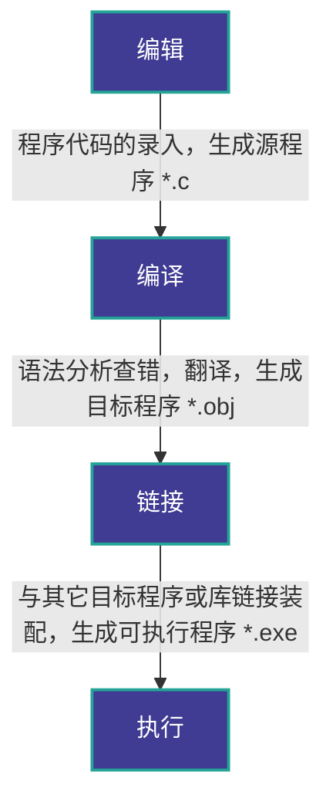

<!-- Generated by scripts/sync-obsidian-notes.mjs from Obsidian Publish. Do not edit by hand. -->

# 程序结构
C程序主要包括一下部分：
- 预处理器指令
- 函数
- [变量](/notes/c-constants-variables-storage/)
- 语句&表达式
- 注释

以“Hello world“为例：
```c
#include <stdio.h>  //预处理器指令，告诉 C 编译器在实际编译之前要包含 stdio.h 文件
 
int main()          //主函数，程序从这里开始执行
{
   /* 我的第一个 C 程序 */  //注释内容
   printf("Hello, World! \n");  // printf(...)是 C 中另一个可用的函数
   
   return 0;       //终止 main() 函数，并返回值 0
}
```

# 基础语法
C 语言的令牌主要包括以下几种类型：
- **关键字（Keywords）**
- **标识符（Identifiers）**
- **[常量](/notes/c-constants-variables-storage/)（Constants）**
- **字符串字面量（String Literals）**
- **运算符（Operators）**
- **分隔符（Separators）**
# C 程序的基本结构
```C
#include <stdio.h>   // 头文件包含

#define PI 3.14159    // 宏定义

// 函数声明
int add(int a, int b);

int main() {         // 主函数
    // 变量声明
    int num1, num2, sum;

    // 用户输入
    printf("Enter two integers: ");
    scanf("%d %d", &num1, &num2);

    // 函数调用
    sum = add(num1, num2);

    // 输出结果
    printf("Sum: %d\n", sum);

    return 0;        // 返回 0 表示程序成功执行
}

// 函数定义
int add(int a, int b) {
    return a + b;
}
```

# 头文件包含
- 头文件通常在程序的开头使用 `#include` 指令包含。头文件提供了函数和库的声明，如标准输入输出库 `<stdio.h>`、标准库 `<stdlib.h>` 等。它们定义了函数、宏、常量等使程序能够使用预定义的库函数。
- 示例：`#include <stdio.h>`

# 宏定义
- 宏是通过 `#define` 指令定义的符号常量或代码片段。宏在编译前由预处理器替换为其定义的内容。常用于定义常量或者复杂的代码块。
- 示例：`#define PI 3.14159`

# 函数声明
- 在 C 语言中，函数的声明必须在函数定义或调用之前。声明提供了函数的返回类型、函数名和参数列表，以便编译器知道如何调用该函数。
- 示例：`int add(int a, int b);`

# 主函数
- `main()` 函数是 C 程序的入口点，每个 C 程序都必须包含一个 `main()` 函数。程序从 `main()` 开始执行，返回值通常为 `0` 表示程序成功执行。
- 示例：`int main() { ... }`

# [变量](/notes/c-constants-variables-storage/)声明
- 在 C 程序中，所有变量必须在使用前声明。变量可以在 `main()` 函数中声明，也可以在其他函数中或全局声明。
- 示例：
    
    printf("Enter two integers: ");
    sum = add(num1, num2);
    

#  语句和表达式
- 语句是 C 程序的基本执行单元，通常是函数调用、赋值、控制语句（如 `if`、`for` 等）或表达式。表达式是由[变量](/notes/c-constants-variables-storage/)、操作符和常量组成的代码片段。
- 示例：
    
    printf("Enter two integers: ");
    sum = add(num1, num2);
    

# 控制流语句
- 控制流语句用于控制程序执行的顺序，包括 `if`、`for`、`while`、`do-while` 等循环和条件分支语句。
- 示例：
    
    if (num1 > num2) {
        printf("num1 is greater than num2");
    }
    

# 函数定义
- 函数定义包含实际的函数体，它描述了函数的具体实现。函数通常包含参数、局部变量和返回值。
- 示例：
    
    int add(int a, int b) {
        return a + b;
    }
    

# 返回语句
- `return` 语句用于终止函数的执行，并将控制权交还给调用函数。`main()` 函数的返回值通常是 `0` 表示正常执行。
- 示例：`return 0;`  
---
# 分隔符
分隔符用于分隔语句和表达式，常见的分隔符包括：

- **逗号 ,** ：用于分隔变量声明或函数参数。
- **分号 ;** ：用于结束语句。
- **括号**：
    - 圆括号 `()` 用于分组表达式、函数调用。
    - 花括号 `{}` 用于定义代码块。
    - 方括号 `[]` 用于数组下标。

在 C 程序中，分号 ; 是语句结束符，也就是说，每个语句必须以分号结束，它表明一个逻辑实体的结束。

例如，下面是两个不同的语句：
```C
printf("Hello, World! \n");
return 0;
```

一个单独的分号也可以作为一个空语句，表示什么都不做。例如：`;`

---
# 标识符
标识符是程序中变量、函数、数组等的名字。标识符由 *字母（大写或小写）、数字和下划线* 组成，但**第一个字符必须是字母或下划线**，不能是数字。

一个标识符以字母 A-Z 或 a-z 或下划线 _ 开始，后跟零个或多个字母、下划线和数字（0-9）。

C 标识符内不允许出现标点字符，比如 @、$ 和 %。C 是**区分大小写**的编程语言。因此，在 C 中，_Manpower_ 和 _manpower_ 是两个不同的标识符。下面列出几个有效的标识符：
```
mohd       zara    abc   move_name  a_123
myname50   _temp   j     a23b9      retVal
```
---
# [常量](/notes/c-constants-variables-storage/)
常量是固定值，在程序执行期间不会改变。

常量可以是整型常量、浮点型常量、字符常量、枚举常量等。
```
const int MAX = 100;  // 整型常量
const float PI = 3.14;  // 浮点型常量
const char NEWLINE = '\n';  // 字符常量
```
**const**是常量的标识

---
# 关键字
下表列出了 C 中的保留字。这些保留字不能作为[常量](#)名、[变量](#)名或其他标识符名称。
## 常用

| 关键字      | 说明                                 |
| -------- | ---------------------------------- |
| auto     | 声明自动变量                             |
| break    | 跳出当前循环                             |
| case     | 开关语句分支                             |
| char     | 声明字符型变量或函数返回值类型                    |
| const    | 定义常量，如果一个变量被 const 修饰，那么它的值就不能再被改变 |
| continue | 结束当前循环，开始下一轮循环                     |
| default  | 开关语句中的"其它"分支                       |
| do       | 循环语句的循环体                           |
| double   | 声明双精度浮点型变量或函数返回值类型                 |
| else     | 条件语句否定分支（与 if 连用）                  |
| enum     | 声明枚举类型                             |
| extern   | 声明变量或函数是在其它文件或本文件的其他位置定义           |
| float    | 声明浮点型变量或函数返回值类型                    |
| for      | 一种循环语句                             |
| goto     | 无条件跳转语句                            |
| if       | 条件语句                               |
| int      | 声明整型变量或函数                          |
| long     | 声明长整型变量或函数返回值类型                    |
| register | 声明寄存器变量                            |
| return   | 子程序返回语句（可以带参数，也可不带参数）              |
| short    | 声明短整型变量或函数                         |
| signed   | 声明有符号类型变量或函数                       |
| sizeof   | 计算数据类型或变量长度（即所占字节数）                |
| static   | 声明静态变量                             |
| struct   | 声明结构体类型                            |
| switch   | 用于开关语句                             |
| typedef  | 用以给数据类型取别名                         |
| unsigned | 声明无符号类型变量或函数                       |
| union    | 声明共用体类型                            |
| void     | 声明函数无返回值或无参数，声明无类型指针               |
| volatile | 说明变量在程序执行中可被隐含地改变                  |
| while    | 循环语句的循环条件                          |
## C99 新增关键字
|       |          |            |        |          |
| ----- | -------- | ---------- | ------ | -------- |
| _Bool | _Complex | _Imaginary | inline | restrict |
## C11 新增关键字
|                |               |         |          |           |
| -------------- | ------------- | ------- | -------- | --------- |
| _Alignas       | _Alignof      | _Atomic | _Generic | _Noreturn |
| _Static_assert | _Thread_local |         |          |           |

---
# 运算符（Operators）
运算符用于执行各种操作，如算术运算、逻辑运算、比较运算等。

C 语言中的运算符种类繁多，常见的包括：

- **算术运算符**：`+`, `-`, `*`, `/`, `%`
- **关系运算符**：`==`, `!=`, `>`, `<`, `>=`, `<=`
- **逻辑运算符**：`&&`, `||`, `!`
- **位运算符**：`&`, `|`, `^`, `~`, `<<`, `>>`
- **赋值运算符**：`=`, `+=`, `-=`, `*=`, `/=`, `%=`
- **其他运算符**：`sizeof`, `?:`, `&`, `*`, `->`, `.`
# C 的数据类型
C 中的类型可分为以下几种：

| 序号  | 类型与描述                                                                  |
| --- | ---------------------------------------------------------------------- |
| 1   | **基本数据类型**  <br>它们是算术类型，包括整型（int）、字符型（char）、浮点型（float）和双精度浮点型（double）。 |
| 2   | **枚举类型：**  <br>它们也是算术类型，被用来定义在程序中只能赋予其一定的离散整数值的变量。                     |
| 3   | **void 类型：**  <br>类型说明符 _void_ 表示没有值的数据类型，通常用于函数返回值。                   |
| 4   | **派生类型：**  <br>包括数组类型、指针类型和结构体类型。                                      |

---
# 整数类型
下表列出了关于标准整数类型的存储大小和值范围的细节：

|类型|存储大小|值范围|
|---|---|---|
|char|1 字节|-128 到 127 或 0 到 255|
|unsigned char|1 字节|0 到 255|
|signed char|1 字节|-128 到 127|
|int|2 或 4 字节|-32,768 到 32,767 或 -2,147,483,648 到 2,147,483,647|
|unsigned int|2 或 4 字节|0 到 65,535 或 0 到 4,294,967,295|
|short|2 字节|-32,768 到 32,767|
|unsigned short|2 字节|0 到 65,535|
|long|4 字节|-2,147,483,648 到 2,147,483,647|
|unsigned long|4 字节|0 到 4,294,967,295|
# 浮点类型
下表列出了关于标准浮点类型的存储大小、值范围和精度的细节：

|类型|存储大小|值范围|精度|
|---|---|---|---|
|float|4 字节|1.2E-38 到 3.4E+38|6 位有效位|
|double|8 字节|2.3E-308 到 1.7E+308|15 位有效位|
|long double|16 字节|3.4E-4932 到 1.1E+4932|19 位有效位|
# void 类型

void 类型指定没有可用的值。它通常用于以下三种情况下：

| 序号  | 类型与描述                                                                                                                    |
| --- | ------------------------------------------------------------------------------------------------------------------------ |
| 1   | **函数返回为空**  <br>C 中有各种函数都不返回值，或者您可以说它们返回空。不返回值的函数的返回类型为空。例如 **void exit (int status);**                                  |
| 2   | **函数参数为空**  <br>C 中有各种函数不接受任何参数。不带参数的函数可以接受一个 void。例如 **int rand(void);**                                                |
| 3   | **指针指向 void**  <br>类型为 `void *` 的指针代表对象的地址，而不是类型。例如，内存分配函数 **`void *malloc( size_t size );`** 返回指向 void 的指针，可以转换为任何数据类型。 |
# 运行C程序的步骤与方法

# 一、 运行步骤流程


# 二、 程序文件对比

|           |  源程序   |  目标程序  | 可执行程序  |
| :-------- | :----: | :----: | :----: |
| **内容**    | 程序设计语言 |  机器语言  |  机器语言  |
| **可执行**   |  不可以   |  不可以   |   可以   |
| **文件名后缀** |  `.c`  | `.obj` | `.exe` |

# 相关笔记

- [c-constants-variables-storage](/notes/c-constants-variables-storage/)
- [c-data-types](/notes/c-data-types/)
- [c-io](/notes/c-io/)
- [c-functions](/notes/c-functions/)
